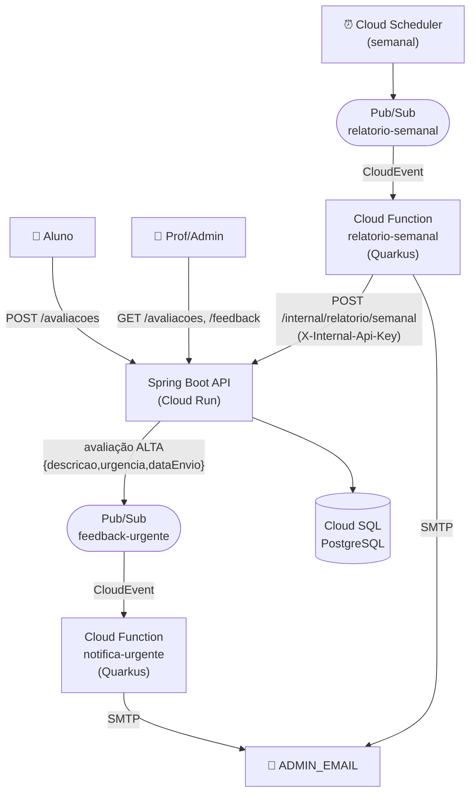

# SysFeedback — Tech Challenge Fase 4 (Grupo 18)

Plataforma de **feedback de aulas** com processamento **serverless** e **mensageria**
na **Google Cloud Platform**. Alunos avaliam as aulas; o sistema **notifica
automaticamente** os administradores sobre avaliações críticas e gera um
**relatório semanal** com a média das avaliações.

Fase focada em **Cloud Computing, Serverless e Deploy em nuvem**.

## Arquitetura

Arquitetura **orientada a eventos**: o backend (Cloud Run) publica eventos no
Pub/Sub e duas Cloud Functions (serverless) reagem a eles — cada uma com uma
responsabilidade única.



### Componentes

| Componente | Tecnologia | Serviço GCP | Responsabilidade |
|---|---|---|---|
| [`SysFeedback/`](SysFeedback/) | Spring Boot 3.5 / Java 21 | Cloud Run | API REST, regras de negócio, produtor de eventos, fonte do relatório |
| [`functions/notifica-urgente/`](functions/notifica-urgente/) | Quarkus / Java 21 | Cloud Functions gen2 | Notificar admin por e-mail em avaliações ALTA (event-driven) |
| [`functions/relatorio-semanal/`](functions/relatorio-semanal/) | Quarkus / Java 21 | Cloud Functions gen2 | Enviar relatório semanal por e-mail (time-driven) |
| Mensageria | — | Pub/Sub | Desacopla produtor e consumidores |
| Agendamento | — | Cloud Scheduler | Dispara o relatório semanal |
| Banco | PostgreSQL | Cloud SQL | Persistência |
| Segredos | — | Secret Manager | Credenciais (SMTP, API key interna, banco) |
| Observabilidade | — | Cloud Logging / Monitoring | Logs e métricas (ver [docs/monitoramento.md](docs/monitoramento.md)) |

## Requisitos do desafio → onde estão atendidos

| Requisito | Atendimento |
|---|---|
| Ambiente de nuvem com segurança e governança de acesso | GCP, IAM least-privilege, Secret Manager, API key interna — [docs/deploy-functions.md](docs/deploy-functions.md) |
| Componentes de suporte (banco etc.) | Cloud SQL PostgreSQL |
| Deploy automatizado dos componentes atualizáveis (funções) | GitHub Actions [`deploy-functions.yml`](.github/workflows/deploy-functions.yml) |
| Aplicação monitorada | Cloud Logging/Monitoring — [docs/monitoramento.md](docs/monitoramento.md) |
| Notificações automáticas para itens críticos | `feedback-urgente` → função `notifica-urgente` |
| Relatório semanal com média | Cloud Scheduler → `relatorio-semanal` |
| Mínimo 2 funções serverless, responsabilidade única | `notifica-urgente` (notificar) e `relatorio-semanal` (relatar) |

## Como rodar

> **Build sempre via Docker** (Java 21 + Maven), independente do Java local.
> Decisão em [docs/adr/0002](docs/adr/0002-quarkus-para-cloud-functions.md).

### Backend (Spring Boot)

Precisa de um PostgreSQL (banco `grupo18`, user `postgres`, senha `123456` — ajuste
em `SysFeedback/src/main/resources/application.properties`). Depois:

```bash
cd SysFeedback && ./mvnw spring-boot:run   # porta 8080
```

Na primeira subida o banco é populado (3 usuários + 18 avaliações). Usuários:
`admin@fiap.com` / `professor@fiap.com` / `aluno@fiap.com` (senha `123456`).

### Testes (via Docker)

```bash
# Backend
docker run --rm -v "$PWD/SysFeedback:/app" -w /app maven:3.9-eclipse-temurin-21 mvn -B clean package
# Funções
cd functions/notifica-urgente && docker build -t notifica-urgente:build .
cd functions/relatorio-semanal && docker build -t relatorio-semanal:build .
```

## Endpoints principais

| Método | Rota | Autorização |
|---|---|---|
| POST | `/auth/login` | público |
| POST | `/avaliacoes` | ALUNO |
| GET | `/avaliacoes` | PROFESSOR, ADMIN |
| POST/GET | `/feedback` | PROFESSOR, ADMIN |
| POST | `/internal/relatorio/semanal` | API key interna (`X-Internal-Api-Key`) |

Coleção Postman completa em [`POSTMAN_FEEDBACK/`](POSTMAN_FEEDBACK/). A regra de
urgência: nota 0–3 → **ALTA**, 4–6 → MÉDIA, 7–10 → BAIXA.

## Deploy

- **Backend (Cloud Run):** [`deploy.yml`](.github/workflows/deploy.yml) — push em `main`.
- **Funções (Cloud Functions gen2):** [`deploy-functions.yml`](.github/workflows/deploy-functions.yml) — push em `main` que altere `functions/**`.
- **Configuração, segredos e IAM:** [docs/deploy-functions.md](docs/deploy-functions.md).

## Documentação

- **ADRs** (decisões de arquitetura): [docs/adr/](docs/adr/)
- **Deploy e segurança das funções:** [docs/deploy-functions.md](docs/deploy-functions.md)
- **Monitoramento:** [docs/monitoramento.md](docs/monitoramento.md)
- **Diário técnico (decisões e armadilhas):** [docs/lessons.md](docs/lessons.md)
- **Guia do projeto para contribuidores:** [CLAUDE.md](CLAUDE.md)

## Estrutura do repositório (monorepo)

```
SysFeedback/                 # Backend Spring Boot (Cloud Run)
functions/
  notifica-urgente/          # Cloud Function 1 (Quarkus)
  relatorio-semanal/         # Cloud Function 2 (Quarkus)
docs/
  adr/                       # Architecture Decision Records
  deploy-functions.md        # Deploy, segredos e IAM
  monitoramento.md           # Observabilidade
  lessons.md                 # Diário técnico
.github/workflows/           # CI/CD (Cloud Run + Functions)
POSTMAN_FEEDBACK/            # Coleção Postman
```

Por que monorepo? A separação de serviços é **arquitetural** (pastas + deploy e IAM
independentes), o que atende ao critério de "separação de responsabilidades" sem o
atrito de múltiplos repositórios. Ver [docs/adr/0004](docs/adr/0004-monorepo.md).
